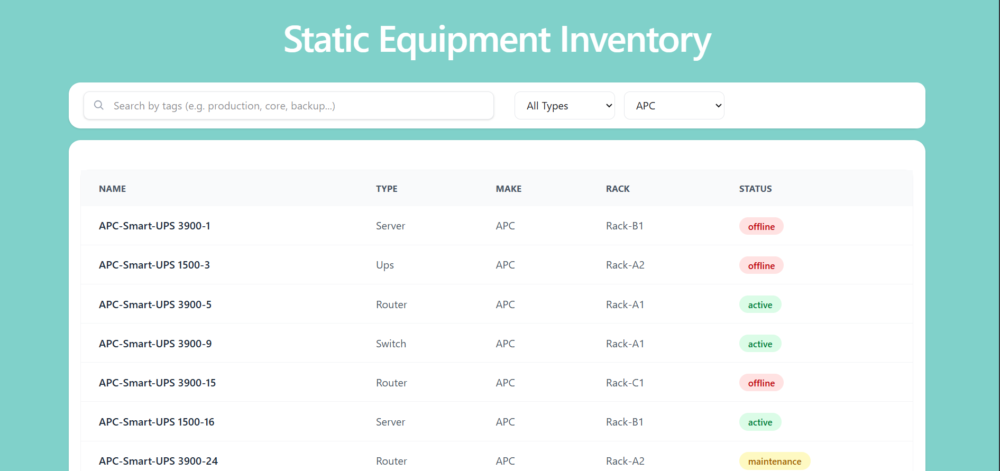

# 📦 Static Equipment Inventory

A web application for viewing and managing IT equipment including servers, switches, routers, and UPS systems. This project simulates real-world data center equipment tracking systems used in production environments.

[](https://www.typescriptlang.org/)
[](https://reactjs.org/)
[](https://nodejs.org/)
[](https://www.postgresql.org/)





---

##  What This Project Does

- **View Equipment** — Browse a comprehensive list of IT assets in a clean table interface
- **Filter by Type** — Narrow down by equipment category (server, switch, router, UPS)
- **Filter by Manufacturer** — Select specific vendors (Dell, Cisco, HP, APC)
- **Tag-Based Search** — Find equipment using keywords like "production", "core", or "backup"
- **Detailed Views** — Click any item to see complete specifications in a modal popup

---


## Project Structure

```
equipment-inventory/
├── backend/               # Data generation + database seeding + JSON export
│   ├── src/
│   │   ├── config/       # Database configuration
│   │   ├── scripts/      # Seed and export scripts
│   │   └── types/        # TypeScript interfaces
│   ├── .env.example
│   └── package.json
│
└── frontend/              # React user interface
    ├── src/
    │   ├── components/   # React components
    │   ├── types/        # Type definitions
    |   ├── /api          # Api from json
    │   └── App.tsx
    ├── public/
    │   └── equipment.json  # Generated data file
    └── package.json
```

---

## Setup Instructions

### Prerequisites

Ensure you have the following installed:
- **Node.js** >= 18.x
- **PostgreSQL** >= 14.x
- **npm** >= 9.x

### 1️⃣ Clone the Repository

```bash
git clone https://github.com/RADshahmat/phase01_static-equipment-inventory.git
cd phase01_static-equipment-inventory
```

### 2️⃣ Setup PostgreSQL Database

Make sure PostgreSQL is running, then create the database:

```sql
CREATE DATABASE equipment_db;
```

### 3️⃣ Configure Backend

```bash
cd backend
npm install
```

Create a `.env` file in the `backend` directory. Example for the localhost setup:

```env
DB_HOST=localhos
DB_PORT=5432
DB_USER=postgres
DB_PASSWORD=your_password
DB_NAME=equipment_db
```

> **Tip:** Copy `.env.example` and update with your credentials

### 4️⃣ Generate Sample Data

Run the seed script to populate the database with 50+ equipment records:

```bash
npm run seed
```

**Expected Output:**
```
Starting seed...
Table ready
Successfully inserted 34 records
Seed completed successfully
```

### 5️⃣ Export Data to Frontend

Generate the JSON file for the frontend:

```bash
npm start
```

This creates `frontend/public/equipment.json` with all database records.

### 6️⃣ Launch Frontend

Open a new terminal window:

```bash
cd frontend
npm install
npm run dev
```

**Access the application at:** http://localhost:5173

---

## Features

### 📋 Equipment List
Browse all equipment in a responsive table with the following columns:
- Equipment Name
- Type
- Manufacturer
- Model
- Rack Location
- Status

### 🔍 Filtering Options

**By Equipment Type:**
- Server
- Switch
- Router
- UPS

**By Manufacturer:**
- Dell
- Cisco
- HP
- APC

### 🔎 Tag-Based Search

Search across equipment tags including:
- `production` — Live production systems
- `core` — Critical infrastructure
- `backup` — Redundancy systems
- `network` — Networking equipment
- `power` — Power distribution

### 📌 Detail View

Click any table row to view comprehensive information:
- Full model specifications
- Exact rack location and unit position
- Current operational status
- All associated tags
- Creation timestamp

---
## 📈 Self-Evaluation (Learning Rubric)

| Dimension | Score | Notes |
|-----------|-------|-------|
| **D1: Functionality** | 4 | All core features working + stretch goals (tag search, empty states) |
| **D2: Code Quality** | 4 | TypeScript throughout, clean component separation, no `any` types |
| **D3: Data Safety** | 4 | Parameterized queries, environment variables, no hardcoded credentials |
| **D4: Setup Experience** | 4 | Clear documentation, works on fresh machine, < 5 min setup |
| **D5: Testing** | 4 | One component test with React Testing Library |

**Overall Score:** 20/20 — **Proficient** ✅

**Status:** Ready for submission and production use

## 📊 Sample Data

Each equipment entry follows this structure:

```json
{
  "name": "Dell-PowerEdge R740-1",
  "type": "server",
  "make": "Dell",
  "model": "PowerEdge R740",
  "rack": "Rack-A1",
  "unitPosition": 12,
  "status": "active",
  "tags": ["production", "core", "rack-mounted"]
}
```
## React Component Test:
```bash
cd frontend
npm test
```
Expected output:
```bash

 DEV  v4.1.5 E:/SSCL Training/phase01_static-equipment-inventory/frontend

 ✓ src/components/EquipmentDetail.test.tsx (4 tests) 70ms
   ✓ EquipmentDetail (4)
     ✓ renders equipment details correctly 48ms
     ✓ renders tags correctly 7ms
     ✓ calls onClose when close button clicked 9ms
     ✓ returns null when item is null 2ms

 Test Files  1 passed (1)
      Tests  4 passed (4)
   Start at  19:19:01
   Duration  5.67s (transform 94ms, setup 471ms, import 591ms, tests 70ms, environment 4.19s)
```
## Running Lint and Result:
```bash
cd backend && npm run lint
cd frontend && npm run lint
```
Both frontend and backend are with 0 lint errors

## ✅ Manual Testing Checklist

### Database Layer
- [✓] Seed script generates 50+ equipment records
- [✓] Data is properly structured with all required fields
- [✓] re-running seed doesn't duplicate rows
- [✓] Database queries execute without errors

### Data Export
- [✓] JSON file is created in `frontend/public/`
- [✓] Exported data matches database records
- [✓] File is properly formatted and readable

### Frontend Functionality
- [✓] Table displays all equipment correctly
- [✓] Type filter works (server, switch, router, UPS)
- [✓] Manufacturer filter works (Dell, Cisco, HP, APC)
- [✓] Tag search returns accurate results
- [✓] Row click opens detail modal
- [✓] Modal displays complete equipment information
- [✓] Empty search results show appropriate message

---
---

## Learning Outcomes

This project demonstrates exemplary in:

✅ **Backend Data Generation** — Creating realistic infrastructure datasets  
✅ **Database Design** — Structured PostgreSQL schemas for equipment tracking  
✅ **Frontend Development** — Building interactive React interfaces with TypeScript  
✅ **Data Filtering** — Implementing multi-criteria search and filter systems  
✅ **Real-World Patterns** — Understanding how admin dashboards function in production

---
---

## Future Enhancements

### Planned Features
- [ ] **Pagination** — Handle large datasets efficiently (1000+ items)
- [ ] **REST API** — Replace static JSON with dynamic API endpoints
- [ ] **Authentication** — Add admin login and role-based access
- [ ] **Real-Time Updates** — WebSocket integration for live status changes
- [ ] **Advanced Search** — Full-text search across all fields
- [ ] **Export Functionality** — Download filtered results as CSV/Excel
- [ ] **Audit Logging** — Track all equipment changes and modifications

### Technical Improvements
- [ ] **E2E Tests** — Playwright for critical user flows
- [ ] **Docker Support** — Containerized deployment
- [ ] **CI/CD Pipeline** — Automated testing and deployment

---

## Troubleshooting

<details>
<summary><b>Database connection fails</b></summary>

**Solution:**
```bash
# Check if PostgreSQL is running
# macOS
brew services list

# Linux
sudo systemctl status postgresql

# Restart if needed
brew services restart postgresql  # macOS
sudo systemctl restart postgresql  # Linux
```
</details>

<details>
<summary><b>"equipment.json" not found in frontend</b></summary>

**Solution:**
```bash
cd backend
npm start  # Re-run export script

# Verify file exists
ls -la ../frontend/public/equipment.json
```
</details>

<details>
<summary><b>Frontend shows blank page</b></summary>

**Solution:**
1. Check browser console for errors
2. Verify `equipment.json` exists in `frontend/public/`
3. Ensure frontend dev server is running on port 5173
4. Clear browser cache and reload
</details>

<details>
<summary><b>Seed script fails</b></summary>

**Solution:**
1. Verify database exists: `psql -U postgres -l`
2. Check `.env` credentials are correct
3. Ensure PostgreSQL user has proper permissions
4. Try dropping and recreating the database
</details>

---


## 🧪 Running the Success-Check

Each Success-checks is fully independent. Enter into the desired folder using 
````bash
cd success_check_phase01/<desired folder>
````
or follow the success_check_phase01 folder's readme file instructions

## React Auth App (Phase 1.2 Success Check)

cd success_checks_phase01/p1.2_React-auth-app
npm install
npm run dev

Runs on:

http://localhost:5174 (or next available port)

success_checks are some small demonstrations and do not require full setup for all.
---

## 👨‍💻 Author

*Md. Rad Shahmat**  
Full-Stack Software Engineer

- GitHub: [@RADshahmat](https://github.com/RADshahmat)
- LinkedIn: [Connect with me](https://www.linkedin.com/in/rad-shahmat-cse-pstu)

---

## 🙏 Acknowledgments

- Built as part of the InfraSight Learning Roadmap
- Demonstrates core full-stack development competencies
- Prepared for production-level data center management systems
- Thanks to the open-source community for excellent tooling

---

## 📄 License

MIT License - See [LICENSE](LICENSE) file for details

---


